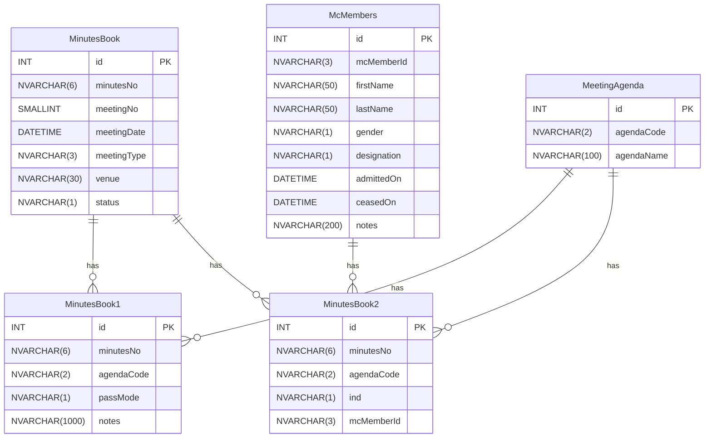

The goal is to streamline the process of generating meeting minutes for managing committee meetings, covering topics like expense approvals, nominations, share transfers, etc. By implementing a system, we aim to automate the generation of minutes, eliminating the need for manual drafting in Word documents.

<!-- #### Explore ChatGPT `Underdevelopment`
- Check Grammer
- Give suggestions for changes -->

#### Discussed Points

- Need to add Date Component like MFG.
- While inserting attended taking Agenda Code as 05 for both A and L ind.
- For getting next and previous date we will also pass type? `Doubt`
- Minutes No will not be based on year right? `Doubt`

{}

- Need to add Date Component like MFG.
- While inserting attended taking Agenda Code as 05 for both A and L ind.
- For getting next and previous date we will also pass type? `Doubt`
- Minutes No will not be based on year right? `Doubt`

{}

#### Database Structure

- We will need five tables to store relevant data:

1. Managing Committee Members Table
   This table will contain details of all committee members
2. Meeting Agenda Table
   It will contain various sections which will be there in the minutes documents.
3. Minutes Book Main Level Table
   This table will store details such as meeting no, date, venue etc.
4. Minutes Book Line Level 1 Table
   This table will store details about each section.
5. Minutes Book Line Level 2 Table
   This table will store details about readby, proposed by etc.

{}

- We will need five tables to store relevant data:

1. Managing Committee Members Table
   This table will contain details of all committee members
2. Meeting Agenda Table
   It will contain various sections which will be there in the minutes documents.
3. Minutes Book Main Level Table
   This table will store details such as meeting no, date, venue etc.
4. Minutes Book Line Level 1 Table
   This table will store details about each section.
5. Minutes Book Line Level 2 Table
   This table will store details about readby, proposed by etc.

{}


```SQL
--- Managing Committee Members Table
CREATE TABLE McMembers
(
    id INT PRIMARY KEY IDENTITY(1,1),
    mcMemberId NVARCHAR(3),
    firstName NVARCHAR(50),
    lastName NVARCHAR(50),
    gender NVARCHAR(1),
    designation NVARCHAR(1), -- HC Combo (Chairman(C), Secretary(S), Treasurer(T), Member(Z))
    admittedOn DATETIME, --- future date not allowed
    ceasedOn DATETIME, --- By default will be 31-Mar-2049
    notes NVARCHAR(200)
);

--- Managing Committee Section Table
CREATE TABLE MeetingAgenda
(
    id INT PRIMARY KEY IDENTITY(1,1),
    agendaCode NVARCHAR(2),
    agendaName NVARCHAR(100)
);

--- Minutes Data Main Level Table
-- (AGM - Annual General Meeting, SGM - Special General Meeting, MCM - Managing Committee)
CREATE TABLE MinutesBook
(
    id INT PRIMARY KEY IDENTITY(1,1),
    minutesNo NVARCHAR(6),
    meetingNo SMALLINT,
    meetingDate DATETIME,
    meetingType NVARCHAR(3), -- HC Combo (AGM, SGM, MCM)
    venue NVARCHAR(30),
    status NVARCHAR(1) -- HC Combo (Draft, Confirmed)
);

--- Minutes Data Line Level 1 Table
CREATE TABLE MinutesBook1
(
    id INT PRIMARY KEY IDENTITY(1,1),
    minutesNo NVARCHAR(6),
    agendaCode NVARCHAR(2),
    passMode NVARCHAR(1), -- HC Combo (U - Unanimously, M - By Majority)
    notes NVARCHAR(1000)
);

--- Minutes Data Line Level 2 Table
CREATE TABLE MinutesBook2
(
    id INT PRIMARY KEY IDENTITY(1,1),
    minutesNo NVARCHAR(6),
    agendaCode NVARCHAR(2),
    ind NVARCHAR(1), -- (P - ProposedBy, S - SecondedBy, R - ReadBy, L - Leave of Absence, A - Attended)
    mcMemberId NVARCHAR(3)
);
```





```sql
CREATE TABLE McMembers
(
    id INT PRIMARY KEY IDENTITY(1,1),
    mcMemberId NVARCHAR(3),
    firstName NVARCHAR(50),
    lastName NVARCHAR(50),
    gender NVARCHAR(1),
    designation NVARCHAR(1), -- HC Combo (Chairman(C), Secretary(S), Treasurer(T), Member(Z))
    admittedOn DATETIME, --- future date not allowed
    ceasedOn DATETIME, --- By default will be 31-Mar-2049
    notes NVARCHAR(200)
);
```




```sql
--- Managing Committee Section Table
CREATE TABLE MeetingAgenda
(
    id INT PRIMARY KEY IDENTITY(1,1),
    agendaCode NVARCHAR(2),
    agendaName NVARCHAR(100)
);
```



```sql
--- Minutes Data Main Level Table
-- (AGM - Annual General Meeting, SGM - Special General Meeting, MCM - Managing Committee)
CREATE TABLE MinutesBook
(
    id INT PRIMARY KEY IDENTITY(1,1),
    minutesNo NVARCHAR(6),
    meetingNo SMALLINT,
    meetingDate DATETIME,
    meetingType NVARCHAR(3), -- HC Combo (AGM, SGM, MCM)
    venue NVARCHAR(30),
    status NVARCHAR(1) -- HC Combo (Draft, Confirmed)
);
```



```sql
--- Minutes Data Line Level 1 Table
CREATE TABLE MinutesBook1
(
    id INT PRIMARY KEY IDENTITY(1,1),
    minutesNo NVARCHAR(6),
    agendaCode NVARCHAR(2),
    passMode NVARCHAR(1), -- HC Combo (U - Unanimously, M - By Majority)
    notes NVARCHAR(1000)
);
```



```sql
--- Minutes Data Line Level 2 Table
CREATE TABLE MinutesBook2
(
    id INT PRIMARY KEY IDENTITY(1,1),
    minutesNo NVARCHAR(6),
    agendaCode NVARCHAR(2),
    ind NVARCHAR(1), -- (P - ProposedBy, S - SecondedBy, R - ReadBy, L - Leave of Absence, A - Attended)
    mcMemberId NVARCHAR(3)
);


```




#### MC Members

##### Managing Committee Index Page

- Fields and properties

| Field Name  | Property        |
| ----------- | --------------- |
| Member Id   | McMemberId      |
| Member Name | McMemberName    |
| Designation | DesignationName |
| Is Live     | IsLiveName      |

- Features

1. Create
2. Back `Redirect to MC Minutes Index page`

- Points

1. For islive we will do IIF(CeasedOn = '31-Mar-49', 'Yes', 'No') AS isLiveName

##### Managing Committee Details Page

- Fields and properties

| Field Name  | Property        |
| ----------- | --------------- |
| Member Id   | McMemberId      |
| Member Name | McMemberName    |
| Gender      | GenderName      |
| Designation | DesignationName |
| Admitted On | AdmittedOn      |
| Ceased On   | CeasedOn        |
| Notes       | Notes           |

- Features

1. Create
2. Modify `Don't allow when ceased on is not 31-Mar-49`
3. Delete `Don't allow when it is used in minutes or ceased on is not 31-Mar-49`
4. Back `Redirect to Managing Committee Index Page`

##### Managing Committee Create Page

- Fields and properties

| Field Name                                                                                                                                             | Property    |
| ------------------------------------------------------------------------------------------------------------------------------------------------------ | ----------- |
| First Name                                                                                                                                             | FirstName   |
| Last Name                                                                                                                                              | LastName    |
| Gender                                                                                                                                                 | Gender      |
| Designation `HC Combo`                                                                                                                                 | Designation |
| Admitted On                                                                                                                                            | AdmittedOn  |
| I confirm that all details entered are correct (including spellings) and I understatnd that modifications will not be allowed once the record is saved | `Checkbox`  |

- Points

1. CeasedOn take as `31-Mar-49`
2. Future Dates are not allowed for AdmittedOn `Use date Component`
3. Member Id will be system generated.
4. HC Combo for Designation (Chairman - C, Secretary - S, Treasurer - T, Member - Z)

- Validation

| Validations                                                                                                                                            |
| ------------------------------------------------------------------------------------------------------------------------------------------------------ |
| Admitted On date cannot be future date. `Use date Component`                                                                                           |
| Admitted on can't be before {DateTime.Now.Date.AddDays(-30)}                                                                                           |
| Please Confirm `If check box is not selected`                                                                                                          |
| This designation is already used for another active MC Member. `For chairman, secretary and treasurer only 1 valid record can be present in the table` |

- Duplicate Designation query

```C#
// Same query used for Change Designation also
// If during Change Designation duplicate is coming then show below validation
// This Designation is already used for another active MC Member.

var modifyWhereClause = id == 0 ? "" : "AND id != @id";

var query = $@"SELECT COUNT(*) FROM McMembers
WHERE designation = @designation AND ceasedOn = '31-Mar-49'
{modifyWhereClause}";
```

##### Managing Committee Modify Page

- Fields and properties

| Field Name                 | Property                                                            |
| -------------------------- | ------------------------------------------------------------------- |
| Member Id `Readonly`       | McMemberId                                                          |
| Member Name `Readonly`     | McMemberName                                                        |
| Admitted On `Readonly`     | AdmittedOn                                                          |
| Option Type `HC Combo`     | OptionType `C - Change Designation, T - Termainate Membership`      |
| Designation `Readonly`     | Designation                                                         |
| New Designation `HC Combo` | NewDesignation                                                      |
| Effective Date / Ceased On | CeasedOn                                                            |
| Notes                      | Notes `Required. Placeholder : Resignation, End of Term of MC etc.` |

- Points

1. Future Dates are not allowed for CeasedOn `Date Component`
2. If ceased on is not 31-Mar-49 then redirecting and show validation in snackbar
3. **Option Type C** - Show readonly field member id, name, admitted on and designation. Show editable fields NewDesignation, Effective Date, Notes.
   Once everything is filled then check validations.
   If everything is ok then Update the old record notes as new notes filled and ceased on as Effective Date.
   Create a new record with new memberid generated by system, member name, gender and admitted on from old record, NewDesignation as designation, notes as empty and ceased on as 31-Mar-49.
4. **Option Type T** - Show readonly field member id, name and admitted on. Show editable fields Ceased On, Notes.
   Check validations.
   If everything is ok then update the record ceasedon and notes as given by user.

- Validation

| Validations                                                                        |
| ---------------------------------------------------------------------------------- |
| Ceased On date / Effective Date cannot be future date. `Date Component`            |
| Ceased on can't be prior to admission date                                         |
| Ceased on can't be before {DateTime.Now.Date.AddDays(-30)}                         |
| New Designation needs to be selected. `For Option Type C`                          |
| Notes needs to be filled.                                                          |
| This Designation is already used for another active MC Member. `For Option Type C` |
| Old and new designation cannot be same. `For Option Type C`                        |

##### Validation MC Member Details Page message

| Validations                                                                                                                                                                |
| -------------------------------------------------------------------------------------------------------------------------------------------------------------------------- |
| Member has resigned, delete or modify is not allowed `Modify delete don't allow when CeasedOn is not 31-Mar-49. Give the validation only when delete or modify is clicked` |
| This record is linked to the MC Minutes and may not be deleted `Give the validation only when delete is clicked`                                                           |

{}


##### Managing Committee Index Page

- Fields and properties

| Field Name  | Property        |
| ----------- | --------------- |
| Member Id   | McMemberId      |
| Member Name | McMemberName    |
| Designation | DesignationName |
| Is Live     | IsLiveName      |

- Features

1. Create
2. Back `Redirect to MC Minutes Index page`

- Points

1. For islive we will do IIF(CeasedOn = '31-Mar-49', 'Yes', 'No') AS isLiveName

##### Managing Committee Details Page

- Fields and properties

| Field Name  | Property        |
| ----------- | --------------- |
| Member Id   | McMemberId      |
| Member Name | McMemberName    |
| Gender      | GenderName      |
| Designation | DesignationName |
| Admitted On | AdmittedOn      |
| Ceased On   | CeasedOn        |
| Notes       | Notes           |

- Features

1. Create
2. Modify `Don't allow when ceased on is not 31-Mar-49`
3. Delete `Don't allow when it is used in minutes or ceased on is not 31-Mar-49`
4. Back `Redirect to Managing Committee Index Page`

##### Managing Committee Create Page

- Fields and properties

| Field Name                                                                                                                                             | Property    |
| ------------------------------------------------------------------------------------------------------------------------------------------------------ | ----------- |
| First Name                                                                                                                                             | FirstName   |
| Last Name                                                                                                                                              | LastName    |
| Gender                                                                                                                                                 | Gender      |
| Designation `HC Combo`                                                                                                                                 | Designation |
| Admitted On                                                                                                                                            | AdmittedOn  |
| I confirm that all details entered are correct (including spellings) and I understatnd that modifications will not be allowed once the record is saved | `Checkbox`  |

- Points

1. CeasedOn take as `31-Mar-49`
2. Future Dates are not allowed for AdmittedOn `Use date Component`
3. Member Id will be system generated.
4. HC Combo for Designation (Chairman - C, Secretary - S, Treasurer - T, Member - Z)

- Validation

| Validations                                                                                                                                            |
| ------------------------------------------------------------------------------------------------------------------------------------------------------ |
| Admitted On date cannot be future date. `Use date Component`                                                                                           |
| Admitted on can't be before {DateTime.Now.Date.AddDays(-30)}                                                                                           |
| Please Confirm `If check box is not selected`                                                                                                          |
| This designation is already used for another active MC Member. `For chairman, secretary and treasurer only 1 valid record can be present in the table` |


| Validations                                                                                                                                            |
| ------------------------------------------------------------------------------------------------------------------------------------------------------ |
| Admitted On date cannot be future date. `Use date Component`                                                                                           |
| Admitted on can't be before {DateTime.Now.Date.AddDays(-30)}                                                                                           |
| Please Confirm `If check box is not selected`                                                                                                          |
| This designation is already used for another active MC Member. `For chairman, secretary and treasurer only 1 valid record can be present in the table` |


- Duplicate Designation query

```C#
// Same query used for Change Designation also
// If during Change Designation duplicate is coming then show below validation
// This Designation is already used for another active MC Member.

var modifyWhereClause = id == 0 ? "" : "AND id != @id";

var query = $@"SELECT COUNT(*) FROM McMembers
WHERE designation = @designation AND ceasedOn = '31-Mar-49'
{modifyWhereClause}";
```

##### Managing Committee Modify Page

- Fields and properties

| Field Name                 | Property                                                            |
| -------------------------- | ------------------------------------------------------------------- |
| Member Id `Readonly`       | McMemberId                                                          |
| Member Name `Readonly`     | McMemberName                                                        |
| Admitted On `Readonly`     | AdmittedOn                                                          |
| Option Type `HC Combo`     | OptionType `C - Change Designation, T - Termainate Membership`      |
| Designation `Readonly`     | Designation                                                         |
| New Designation `HC Combo` | NewDesignation                                                      |
| Effective Date / Ceased On | CeasedOn                                                            |
| Notes                      | Notes `Required. Placeholder : Resignation, End of Term of MC etc.` |

- Points

1. Future Dates are not allowed for CeasedOn `Date Component`
2. If ceased on is not 31-Mar-49 then redirecting and show validation in snackbar
3. **Option Type C** - Show readonly field member id, name, admitted on and designation. Show editable fields NewDesignation, Effective Date, Notes.
   Once everything is filled then check validations.
   If everything is ok then Update the old record notes as new notes filled and ceased on as Effective Date.
   Create a new record with new memberid generated by system, member name, gender and admitted on from old record, NewDesignation as designation, notes as empty and ceased on as 31-Mar-49.
4. **Option Type T** - Show readonly field member id, name and admitted on. Show editable fields Ceased On, Notes.
   Check validations.
   If everything is ok then update the record ceasedon and notes as given by user.

- Validation

| Validations                                                                        |
| ---------------------------------------------------------------------------------- |
| Ceased On date / Effective Date cannot be future date. `Date Component`            |
| Ceased on can't be prior to admission date                                         |
| Ceased on can't be before {DateTime.Now.Date.AddDays(-30)}                         |
| New Designation needs to be selected. `For Option Type C`                          |
| Notes needs to be filled.                                                          |
| This Designation is already used for another active MC Member. `For Option Type C` |
| Old and new designation cannot be same. `For Option Type C`                        |

##### Validation MC Member Details Page message

| Validations                                                                                                                                                                |
| -------------------------------------------------------------------------------------------------------------------------------------------------------------------------- |
| Member has resigned, delete or modify is not allowed `Modify delete don't allow when CeasedOn is not 31-Mar-49. Give the validation only when delete or modify is clicked` |
| This record is linked to the MC Minutes and may not be deleted `Give the validation only when delete is clicked`                                                           |


{}

#### MC Minutes Meeting Agenda

##### Meeting Agenda Index Page

| Field Name  | Property   |
| ----------- | ---------- |
| Agenda Code | AgendaCode |
| Agenda Name | AgendaName |

- Features

1. Back (Redirect to mcminutes page)

```SQL
INSERT INTO MeetingAgenda VALUES ('05','Leave of Absence');
INSERT INTO MeetingAgenda VALUES ('10','Confirmation of Minutes');
INSERT INTO MeetingAgenda VALUES ('15','Bank Matters');
INSERT INTO MeetingAgenda VALUES ('20','Approval of Expenses');
INSERT INTO MeetingAgenda VALUES ('25','Approval of Budgets');
INSERT INTO MeetingAgenda VALUES ('30','Major Repairs and Maintenance');
INSERT INTO MeetingAgenda VALUES ('35','Conveyance of Property');
INSERT INTO MeetingAgenda VALUES ('40','Recording of Nominations');
INSERT INTO MeetingAgenda VALUES ('45','NOC for Mortgage of Share/Flats');
INSERT INTO MeetingAgenda VALUES ('50','Approval of Transfer of Flats/Share');
INSERT INTO MeetingAgenda VALUES ('55','Approval of Non Occupancy');
INSERT INTO MeetingAgenda VALUES ('60','Approval of Final Accounts');
INSERT INTO MeetingAgenda VALUES ('65','Convening AGM/SGM');
INSERT INTO MeetingAgenda VALUES ('70','Cultural/Festival Activities');
INSERT INTO MeetingAgenda VALUES ('75','Legal Matters');
INSERT INTO MeetingAgenda VALUES ('80','Recovery of Outstanding');
INSERT INTO MeetingAgenda VALUES ('85','Correspondance with Members');
INSERT INTO MeetingAgenda VALUES ('90','Election/Changes in Managing Committee');
INSERT INTO MeetingAgenda VALUES ('99','Any other matter');
```

#### Minutes Book Main Level

##### Minutes Book Main Index Page

- We will show only records with meetingDate between fystart and fyend of postlogin yearlabel.
- Fields and properties

| Field Name        | Property        |
| ----------------- | --------------- |
| MC Minutes No     | McMinutesNo     |
| Meeting No        | MeetingNo       |
| Meeting Date/Time | MeetingDateTime |
| Meeting Type      | MeetingTypeName |
| Status            | StatusName      |

- Features

1. Create
2. MC Members
3. Meeting Agenda

##### Minutes Book Main Details Page

- Fields and properties

| Field Name        | Property        |
| ----------------- | --------------- |
| MC Minutes No     | McMinutesNo     |
| Meeting No        | MeetingNo       |
| Meeting Date/Time | MeetingDateTime |
| Meeting Type      | MeetingTypeName |
| Venue             | Venue           |
| Status            | StatusName      |

- Features

1. Create
2. Modify
3. MC Minutes Print `Shown when linecnt > 0`
4. Leave of Absence `When status is C then don't allow`
5. Delete `When line cnt is > 0 or status is C then don't allow`
6. Back `Redirect to MC Minutes Main Index Page`

##### Minutes Book Main Create Page

- Fields and properties

| Field Name                                         | Property        |
| -------------------------------------------------- | --------------- |
| Meeting No `When record cnt 0 and type is not SGM` | MeetingNo       |
| Meeting Date / Time                                | MeetingDateTime |
| Meeting Type `HC Combo`                            | MeetingTypeName |
| Venue                                              | Venue           |

- Points

1. MC Minutes No will be system generated
2. If record cnt is 0 for selected meeting Type AGM and MC in table then only meetingNo user will input, Else system will calculate and increment it.
3. If record cnt is 0 and meeting type is SGM then system will generate from 1 to so on as meeting No. User will not fill it.
4. Status will be inserted as D `Draft`.
5. Meeting date cannot be future dates `Date Component`
6. Meeting No range can be 1 to 1000
7. After inserting main level, insert all active members as Attended in the MinutesBook2 table.

```SQL
-- MinutesBook main level insert
INSERT INTO McMinutes(MinutesNo,meetingNo,meetingDate,meetingType,
venue,status)
VALUES(@MinutesNo,@meetingNo,@meetingDate,@meetingType,
@venue,@status)

-- MinutesBook2 line level insert
INSERT INTO MinutesBook2 (minutesNo,agendaCode,ind,mcMemberId)
(SELECT @minutesNo,'05', 'A', mcMemberId
FROM McMembers
WHERE ceasedon = '31-Mar-49')
```





```sql
-- MinutesBook main level insert
INSERT INTO McMinutes(MinutesNo,meetingNo,meetingDate,meetingType,
venue,status)
VALUES(@MinutesNo,@meetingNo,@meetingDate,@meetingType,
@venue,@status)
```




```sql
-- MinutesBook2 line level insert
INSERT INTO MinutesBook2 (minutesNo,agendaCode,ind,mcMemberId)
(SELECT @minutesNo,'05', 'A', mcMemberId
FROM McMembers
WHERE ceasedon = '31-Mar-49')
```



- Validation

| Validations                                                               |
| ------------------------------------------------------------------------- |
| Meeting number must be between 1 to 1000                                  |
| Meeting date cannot be future date. `Date Component`                      |
| Next Meeting Date should be after last meeting date {previousMeetingDate} |

##### Minutes Book Main Modify Page

- Fields and properties

| Field Name                                     | Property        |
| ---------------------------------------------- | --------------- |
| MC Minutes No `Readonly`                       | McMinutesNo     |
| Meeting No `Readonly`                          | MeetingNo       |
| Meeting Type `Readonly`                        | MeetingTypeName |
| Meeting Date                                   | MeetingDate     |
| Venue                                          | Venue           |
| Status `Show only when line records are there` | Status          |

- Points

1. Modify meeting date and venue allow to change when linecnt 0
2. Status allow to change only when linecnt > 0 `Show both Draft and Confirmed`
3. Meeting date cannot be future dates `Date Component`
4. If status is C then don't allow to modify

- Validation

| Validations                                                               |
| ------------------------------------------------------------------------- |
| Meeting date cannot be future date. `Date Component`                      |
| Next Meeting Date should be after last meeting date {previousMeetingDate} |

##### Validation for MC Minutes Main Details Page

| Validations                                                                                                                                         |
| --------------------------------------------------------------------------------------------------------------------------------------------------- |
| Minutes are already confirmed, You may not modify or delete it. `Modify don't allow when Status is approved. Show when delete or modify is clicked` |
| One or more sections are been added, you may not delete it. `FOR DELETE. Show when delete is clicked`                                               |

- A warning message will be shown for main level delete. If the minutes of Jun month is deleted and the previous minutes is already confirmed then we will show message `The previous minutes will be changed to draft` and change the previous minutes to draft.
- A warning message will be shown for main level modify. If the minutes of Jun month is getting confirmed and next month minutes is not created then show message `Next minute needs to be created before confirming this`.

```SQL
var whereClause = ind == "D" ? "AND status = 'C'" : "";
SELECT COUNT(*) FROM MinutesBook
WHERE meetingNo = @meetingNo AND meetingtype = @meetingType
{whereClause}


UPDATE MinutesBook SET status='D'
WHERE meetingNo= @meetingNo AND meetingType = @meetingType";
```

##### Leave of Absence Link

1. Show all the members inserted as attended in minutesbook2 table for that minutesNo in a check list.
2. User will tick the checkbox for the required members and click on Save button.
3. Ind will be updated as L for all members which are selected from the check list.
4. Columns for this will be check box and member name

```SQL
SELECT M2.id, CONCAT_WS(' - ', CONCAT_WS(' ', firstName, lastName), QUOTENAME(M2.McMemberId)) AS MemberName,
M2.mcmemberid AS memberid
FROM MinutesBook2 M2
LEFT JOIN McMembers M ON M2.mcmemberid = M.mcmemberid
WHERE minutesno = @minutesno AND ind = 'A' AND agendacode = '05'


UPDATE MinutesBook2 SET ind = 'L'
WHERE id = @id
```

#### Minutes Book 1 Line Level

##### Minutes Book 1 Line Index Page

- Fields and properties

| Field Name    | Property     |
| ------------- | ------------ |
| MC Minutes No | McMinutesNo  |
| Agenda        | AgendaName   |
| Passed        | PassModeName |

- Features

1. Create
2. Back `Redirect to MC Minutes Main Details Page`

- Discussed Point

1. Do ORDER BY agendaCode ASC

##### Minutes Book 1 and 2 Line Details Page

- Fields and properties

| Field Name    | Property       |
| ------------- | -------------- |
| MC Minutes No | McMinutesNo    |
| Agenda        | AgendaName     |
| Read By       | ReadByName     |
| Proposed By   | ProposedByName |
| Seconded By   | SecondedByName |
| Passed        | PassModeName   |
| Notes         | Notes          |

- Features

1. Create `When status C then don't allow`
2. Modify `When status C then don't allow`
3. Delete `When status C then don't allow`
4. Back `Redirect to MC Minutes Line Index Page`

```SQL
-- MinutesBook1Details query
WITH A (minutesNo, proposedById, secondedById, readById) AS
(
    SELECT M2.minutesno, mcMemberid,'',''
    FROM MinutesBook2 M2
    LEFT JOIN MinutesBook1 M1 ON M2.minutesno = M1.minutesno AND M2.agendaCode = M1.agendaCode
    WHERE ind = 'P' AND M1.id= @id
    UNION ALL
    SELECT M2.minutesno, '', mcMemberid,''
    FROM MinutesBook2 M2
    LEFT JOIN MinutesBook1 M1 ON M2.minutesno = M1.minutesno AND M2.agendaCode = M1.agendaCode
    WHERE ind = 'S' AND M1.id= @id
    UNION ALL
    SELECT M2.minutesno, '', '', mcMemberid
    FROM MinutesBook2 M2
    LEFT JOIN MinutesBook1 M1 ON M2.minutesno = M1.minutesno AND M2.agendaCode = M1.agendaCode
    WHERE ind = 'R' AND M1.id= @id
),
B (minutesNo, proposedById, secondedById, readById) AS
(
    SELECT Minutesno, MAX(proposedById) AS proposedById,
    MAX(secondedById) AS secondedById,
    MAX(readById) AS readById
    FROM A
    GROUP BY Minutesno
)
SELECT M1.id, M.id AS MainId, M1.minutesNo, A.agendaName, M1.agendaCode,
CONCAT_WS(' - ', A.agendaName, QUOTENAME(M1.agendaCode)) AS AgendaNameCode,
R.mcMemberId AS readById, CONCAT_WS(' ', R.FirstName, R.LastName) AS ReadByName,
CONCAT_WS(' - ', CONCAT_WS(' ', R.FirstName, R.LastName), QUOTENAME(R.mcMemberId)) AS ReadByNameId,
P.mcMemberId AS proposedById, CONCAT_WS(' ', P.FirstName, P.LastName) AS ProposedByName,
CONCAT_WS(' - ', CONCAT_WS(' ', P.FirstName, P.LastName), QUOTENAME(P.mcMemberId)) AS ProposedByNameId,
S.mcMemberId AS secondedById, CONCAT_WS(' ', S.FirstName, S.LastName) AS SecondedByName,
CONCAT_WS(' - ', CONCAT_WS(' ', S.FirstName, S.LastName), QUOTENAME(S.mcMemberId)) AS SecondedByNameId,
IIF(passmode = 'U', 'Unanimously',
IIF(passmode = 'M','By Majority','')) AS passmodename, passmode AS passmodecode, M1.notes
FROM MinutesBook1 M1
LEFT JOIN MinutesBook M ON M1.minutesno = M.minutesno
LEFT JOIN MeetingAgenda A ON M1.agendaCode = A.agendaCode
LEFT JOIN B ON M1.minutesno = B.minutesno
LEFT JOIN McMembers R ON B.readById = R.McMemberId
LEFT JOIN McMembers P ON B.proposedById = P.McMemberId
LEFT JOIN McMembers S ON B.secondedById = S.McMemberId
WHERE M1.id= @id
```

##### Minutes Book 1 and 2 Line Create Page

- Fields and properties

| Field Name                                    | Property       |
| --------------------------------------------- | -------------- |
| MC Minutes No `Readonly`                      | McMinutesNo    |
| Agenda `Required`                             | AgendaCode     |
| Read By `Show when agendaCode 10 is selected` | ReadByCode     |
| Proposed By `Optional`                        | ProposedByCode |
| Seconded By `Optional`                        | SecondedByCode |
| Passed `Optional. HC Combo`                   | PassModeCode   |
| Notes `Required`                              | Notes          |

- Points

1. In proposed and seconded by combo show records where ceasedon is 31-Mar-49
2. In agendaCombo 05 i.e leave of Absence agenda code don't show
3. If agendaCode 10 is selected then Read By field is mandatory to be filled.
4. Either both proposedBy and secondedBy should be empty or both should be filled
5. When readby is filled then insert the selected memberId, agendaCode and ind as R in minutesbook2 table
6. When proposedby is filled then insert the selected memberId, agendaCode and ind as P in minutesbook2 table
7. When secondedBy is filled then insert the selected memberId, agendaCode and ind as S in minutesbook2 table

- Validation

| Validations                                                                               |
| ----------------------------------------------------------------------------------------- |
| Read By needs to be selected `If agendaCode is 10`                                        |
| Proposed By needs to be selected `If secondedBy is filled and proposed By is empty`       |
| Seconded By needs to be selected `If proposedBy is filled and seconded By is empty`       |
| Proposed By and Seconded By cannot be the same `When both are filled and same then check` |
| Same section is already added in the current minutes                                      |

```SQL
INSERT INTO MinutesBook1(MinutesNo,AgendaCode,passmode,notes)
VALUES(@MinutesNo,@AgendaCode,@passmode,@notes)


WITH A (ind, mcMemberId) AS
(
    SELECT 'R' AS ind, @readById
    UNION ALL
    SELECT 'P' AS ind, @proposedById
    UNION ALL
    SELECT 'S' AS ind, @secondedById
)
INSERT INTO MinutesBook2(MinutesNo,AgendaCode,ind,mcMemberId)
(SELECT @MinutesNo,@AgendaCode,ind,mcMemberId
FROM A
WHERE mcMemberId != '')
```

##### Minutes Book 1 and 2 Line Modify Page

- Fields and properties

| Field Name                           | Property       |
| ------------------------------------ | -------------- |
| MC Minutes No `Readonly`             | McMinutesNo    |
| Agenda `Readonly`                    | AgendaName     |
| Read By `Show when agendaCode is 10` | ReadByCode     |
| Proposed By `Optional`               | ProposedByCode |
| Seconded By `Optional`               | SecondedByCode |
| Passed `Optional. HC Combo`          | PassModeCode   |
| Notes                                | Notes          |

- Validation

| Validations                                                                         |
| ----------------------------------------------------------------------------------- |
| Read By needs to be selected `If agendaCode is 10`                                  |
| Proposed By needs to be selected `If secondedBy is filled and proposed By is empty` |
| Seconded By needs to be selected `If proposedBy is filled and seconded By is empty` |
| Proposed By and Seconded By cannot be the same `When both are filled then check`    |

```C#
var query = @"UPDATE MinutesBook1 SET
passmode=@passmodecode,notes=@notes WHERE id= @Id";

var cnt = @"SELECT COUNT(*) FROM MinutesBook2
WHERE ind = @ind AND minutesNo = @minutesNo AND agendaCode = @agendaCode";

var updateQuery = @"UPDATE MinutesBook2 SET mcmemberid = @mcmemberid
WHERE ind = @ind AND minutesNo = @minutesNo AND agendaCode = @agendaCode";

var insertQuery = @"INSERT INTO MinutesBook2(MinutesNo,AgendaCode,ind,mcMemberId) VALUES
(@MinutesNo,@AgendaCode,@ind,@mcMemberId)";

using var connection = _DapperContext.SetClientConnection(dbname);
connection.Execute(query, _MinutesBook1);

if (!string.IsNullOrEmpty(_MinutesBook1.ProposedById))
{
    var cntRecord = connection.QuerySingleOrDefault<int>(cnt, new { ind = 'P', _MinutesBook1.MinutesNo, _MinutesBook1.AgendaCode });
    if (cntRecord == 0)
    {
        connection.Execute(insertQuery, new { ind = 'P', _MinutesBook1.MinutesNo, _MinutesBook1.AgendaCode, mcMemberId =_MinutesBook1.ProposedById });
        connection.Execute(insertQuery, new { ind = 'S', _MinutesBook1.MinutesNo, _MinutesBook1.AgendaCode, mcMemberId =_MinutesBook1.SecondedById });
    }
    else
    {
        connection.Execute(updateQuery, new { ind = 'P', _MinutesBook1.MinutesNo, _MinutesBook1.AgendaCode, mcMemberId =_MinutesBook1.ProposedById });
        connection.Execute(updateQuery, new { ind = 'S', _MinutesBook1.MinutesNo, _MinutesBook1.AgendaCode, mcMemberId =_MinutesBook1.SecondedById });
    }
}

if (!string.IsNullOrEmpty(_MinutesBook1.ReadById))
{
    connection.Execute(updateQuery, new { ind = 'R', _MinutesBook1.MinutesNo, _MinutesBook1.AgendaCode, mcMemberId =_MinutesBook1.ReadById });
}
```

##### Validation for Minutes Book 1 and 2 Line create modify

| Validations                                                                                                                                                                       |
| --------------------------------------------------------------------------------------------------------------------------------------------------------------------------------- |
| Minutes are already confirmed, You may not add line, modify or delete it. `Modify delete don't allow when Status is approved. Message show only when modify or delete is clicked` |

#### Print PDF

- For each meeting Number different pdf will be printed.
- Show when linecnt is > 0 for that meeting number.
- Powered by will also be printed.

```SQL
-- Main level details method can be called
-- SELECT minutesNo, meetingNo, venue, meetingDate AS meetingDateTime,status
-- FROM MinutesBook
-- WHERE id = @id

-- To get table details
SELECT CONCAT_WS(' ', firstName, lastName) AS McMemberName,
IIF(designation = 'C', 'Chairman', IIF(designation = 'S', 'Secretary',
IIF(designation = 'T', 'Treasurer', 'Member'))) AS designationname,
IIF(M2.ind = 'L','LOA','') AS Signature
FROM MinutesBook2 M2
LEFT JOIN Mcmembers M ON M2.mcMemberId = M.mcMemberId
WHERE minutesNo = @minutesNo --'000001'
AND M2.ind IN ('A','L')

-- To get Section details
WITH A(minutesNo, agendaCode, ReadByName) AS
(
    SELECT minutesNo,agendaCode,
    CONCAT_WS(' ',firstName,lastName) AS ReadByName
    FROM MinutesBook2 M2
    LEFT JOIN McMembers M ON M2.mcMemberId = M.mcMemberId
    WHERE ind = 'R' AND minutesNo = @minutesNo
),
B(minutesNo, agendaCode, ProposedByName) AS
(
    SELECT minutesNo,agendaCode,
    CONCAT_WS(' ',firstName,lastName) AS ReadBProposedByNamey
    FROM MinutesBook2 M2
    LEFT JOIN McMembers M ON M2.mcMemberId = M.mcMemberId
    WHERE ind = 'P' AND minutesNo = @minutesNo
),
C(minutesNo, agendaCode, SecondedByName) AS
(
    SELECT minutesNo,agendaCode,
    CONCAT_WS(' ',firstName,lastName) AS SecondedByName
    FROM MinutesBook2 M2
    LEFT JOIN McMembers M ON M2.mcMemberId = M.mcMemberId
    WHERE ind = 'S' AND minutesNo = @minutesNo
),
D (agendaCode, ReadByName, notes, ProposedByName, SecondedByName, PassModeName) AS
(
    SELECT '05' AS agendaCode, '' AS readByName,
    STRING_AGG(CONCAT_WS(' ', firstName, lastName),', ') AS Notes,
    '' AS ProposedByName, '' AS SecondedByName,
    '' AS PassModeName
    FROM MinutesBook2 M2
    LEFT JOIN Mcmembers M ON M2.mcMemberId = M.mcMemberId
    WHERE ind = 'L'
    AND minutesNo = @minutesNo

    UNION ALL

    SELECT M1.agendaCode,COALESCE(A.ReadByName,'') AS ReadByName,M1.notes,
    COALESCE(B.ProposedByName,'') AS ProposedByName,COALESCE(C.SecondedByName,'') AS SecondedByName,
    IIF(M1.PassMode = 'U', 'Unanimously',
    IIF(M1.PassMode = 'M', 'By Majority','')) AS PassModeName
    FROM MinutesBook1 M1
    LEFT JOIN A ON M1.minutesNo = A.minutesNo AND M1.agendaCode = A.agendaCode
    LEFT JOIN B ON M1.minutesNo = B.minutesNo AND M1.agendaCode = B.agendaCode
    LEFT JOIN C ON M1.minutesNo = C.minutesNo AND M1.agendaCode = C.agendaCode
)
SELECT MA.agendaCode, MA.agendaName, ReadByName, notes, ProposedByName, SecondedByName, PassModeName
FROM D
LEFT JOIN MeetingAgenda MA ON D.agendaCode = MA.agendaCode
ORDER BY MA.agendaCode ASC

-- To get chairman name
SELECT CONCAT_WS(' ', firstName, lastName) AS ChairmanName
FROM MinutesBook2 M2
LEFT JOIN Mcmembers M ON M2.mcMemberId = M.mcMemberId
WHERE minutesNo = @minutesNo --'000001'
AND M2.ind IN ('A','L') AND designation = 'C'

-- To get next meeting date
-- Get previousnextmeeting date method will be used
-- var query = $@"SELECT MeetingDate FROM MinutesBook
-- WHERE meetingtype = @meetingtype
-- AND meetingNo = @meetingNo";
-- using var connection = _DapperContext.SetClientConnection(dbname);
-- var data = connection.QuerySingleOrDefault<string>(query, new { meetingNo, meetingType });
-- DateTime? previousMeetingDate = string.IsNullOrEmpty(data) ? Convert.ToDateTime("01-Jan-01") : Convert.ToDateTime(data);
```

##### Standard Structue of Minutes PDF `Example`

`{Draft (Word show only when status is D)} Minutes of {_McMinutes.MeetingNo}` `{MeetingTypeName}` of `{CompanyName}` held at `{_McMinutes.Venue}` at `{_McMinutes.MeetingTime}` on `{Model.MeetingDateTime?.DayOfWeek}`, `{_McMinutes.MeetingDate}`.

The Chairman `{ChairmanName}` occupied the chair and called the Meeting to order.

Following members attended the meeting
`{SrNo},{Name of Member} {Designation} {Signature}`
`{All the member names along with their designation where ceased on is 31-Mar-49 and admittedon is not greater than meeting data will be printed here in a table}`
`{Members who were absent there in signature LOA will be printed}`
`{Signature and Designation will have center alignment}`

Leave Of Absence
`{Mention membername with comma seperation wherever ind is L i.e. Leave of Absence}`

`{Each section and its notes and proposed by will be printed here}`
Confirmation of Minutes
The Minutes were read by `{ReadBy member name}`
`{Notes}`
`{Proposed By name if present}`
`{Seconded By name if present}`
`{PassMode if present}`

Bank Matters
`{Notes}`
`{Proposed By name if present}`
`{Seconded By name if present}`
`{PassMode if present}`

...
...
...
...
`{Print only for sections which are there in that record}`

There being no other matter, the Meeting ended with a vote of thanks to the Chairman.

For `{CompanyName}`

Chairman / Secretary
Dated this `Meeting Date of next meeting.`
